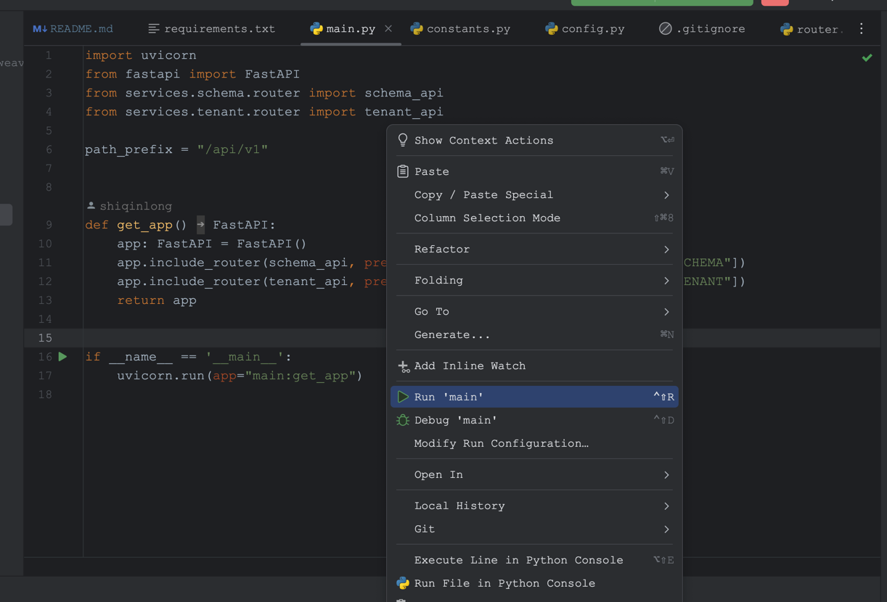

# weaviate-demo
weaviate-demo

# run server on local
1. execute the below command line to install all dependencies defined on the requirements.txt file
`cd app/src`
`pip install -r requirements.txt`
2. go to the main.py and click the right mouse to run the server. like this::
    
    
    
